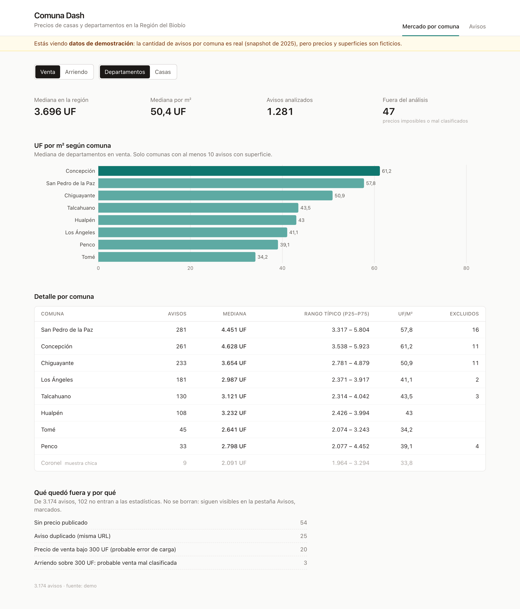
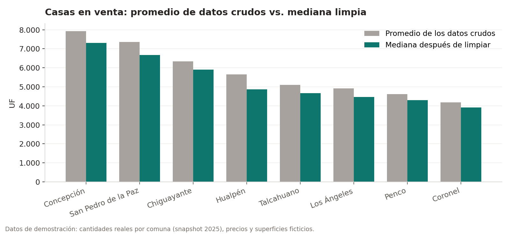
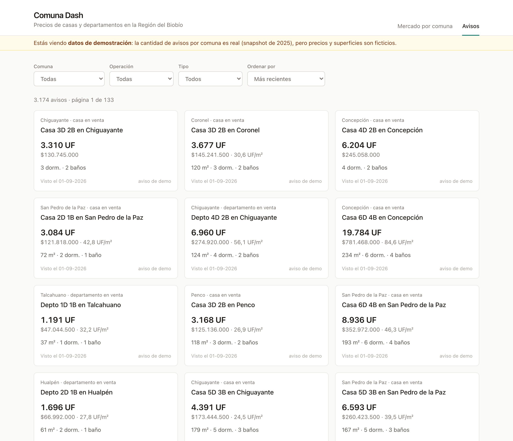
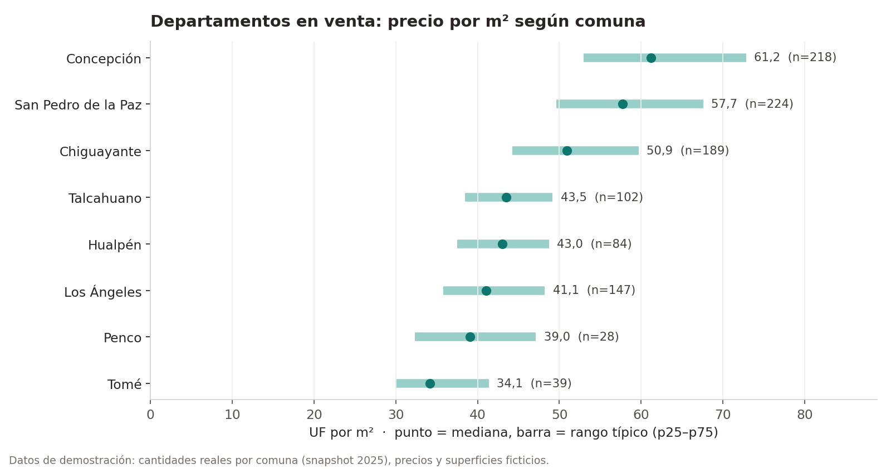
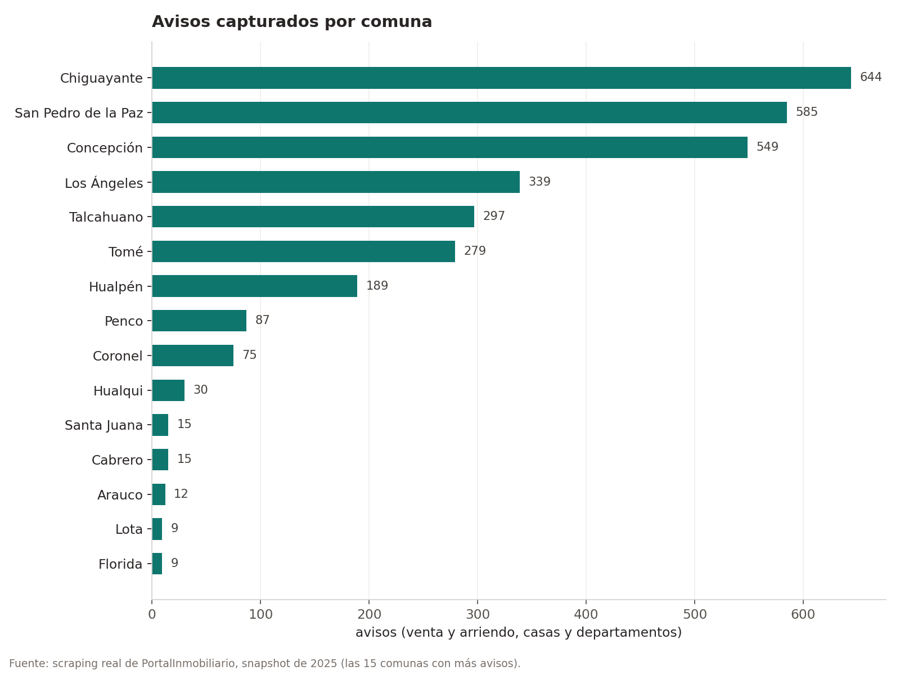

<div align="center">

# Comuna Dash

**¿Cuánto cuesta el metro cuadrado en cada comuna del Biobío?**

Scraper de avisos inmobiliarios + API + dashboard, con un análisis que no se deja engañar por los avisos mal cargados.




</div>

---

## De qué se trata

Quería saber cuánto sale de verdad un departamento en Concepción comparado con San Pedro, Chiguayante o Talcahuano, y los portales no te muestran eso: te muestran avisos uno por uno. Así que armé esto.

El scraper recorre las 33 comunas de la región y guarda cada aviso (casas y departamentos, en venta y en arriendo). La API los limpia y calcula por comuna la mediana, el rango típico y el precio por m². El dashboard lo muestra en dos vistas: una para comparar comunas y otra para revisar los avisos uno a uno.

## Lo más interesante: no confiar en el promedio

La primera versión calculaba promedios, y los números salían raros. Casas en Chiguayante a casi 14.000 UF de promedio, o departamentos *en arriendo* en Los Ángeles a 3.250 UF al mes. Bastaban un par de avisos mal cargados (una venta publicada como arriendo, un precio con ceros de menos) para mover la comuna entera.

Así que ahora el análisis hace tres cosas:

1. **Revisa cada aviso contra reglas simples de plausibilidad.** Un arriendo de más de 300 UF casi siempre es una venta mal clasificada, y una venta bajo 300 UF casi siempre es un error de tipeo. Esos avisos no se borran: quedan fuera de las estadísticas, marcados y con el motivo a la vista.
2. **Usa mediana y percentiles (p25–p75) en vez de promedio.** Un solo valor absurdo no los mueve.
3. **Calcula la UF/m² solo cuando la superficie es creíble.** Nada de avisos con "2 m²".



Las reglas están todas en [`backend/analisis.py`](backend/analisis.py), con sus tests.

## Cómo se ve

<table>
<tr>
<td width="50%"><br>
<sub><b>Avisos.</b> Filtros por comuna, operación y tipo, orden por precio o UF/m². Los que quedaron fuera del análisis aparecen marcados y dicen por qué.</sub></td>
<td width="50%"><br>
<sub><b>Precio por m².</b> El punto es la mediana y la barra, el rango donde cae la mitad de los avisos.</sub></td>
</tr>
</table>

Y este es con datos reales, del scraping que hice en 2025:



> Las imágenes del dashboard y los gráficos de precios usan la **demo**: la cantidad de avisos por comuna viene del scraping real, pero los precios y superficies son inventados. Cada gráfico lo dice en el pie.

## Probarlo en 2 minutos (sin MongoDB)

El repo trae un set de avisos de demo, así que no necesitas instalar nada más que Python y Node.

```bash
git clone https://github.com/JVSharp/comuna-dash.git
cd comuna-dash

# API
cd backend
python -m venv .venv && source .venv/bin/activate    # en Windows: .venv\Scripts\activate
pip install -r requirements.txt
uvicorn main:app --reload                            # http://127.0.0.1:8000/docs

# Dashboard (en otra terminal)
cd comuna-frontend
npm install
npm run dev                                          # http://localhost:5173
```

## Con datos reales

Necesitas MongoDB corriendo en local (o una URI de Atlas).

```bash
cp .env.example .env          # y cambia FUENTE_DATOS=mongo
cd backend
python scraper.py                        # las 33 comunas (demora: pide una página por segundo)
python scraper.py concepcion penco       # o solo algunas
uvicorn main:app --reload
```

Cada aviso se guarda una vez por URL. Si vuelves a correr el scraper se actualiza el precio y la fecha en que se vio por última vez, y se conserva la fecha en que apareció. Con eso queda la base lista para medir cuánto dura publicado un aviso o cómo cambia su precio.

## API

| Ruta | Qué devuelve |
|---|---|
| `GET /propiedades` | Avisos filtrados (`comuna`, `tipo_operacion`, `tipo_inmueble`), ordenados (`orden`) y paginados. Trae `total` y marca los excluidos. |
| `GET /resumen` | Mediana, p25–p75 y UF/m² por comuna, para una operación y un tipo. |
| `GET /resumen/{comuna}` | Todas las combinaciones de una comuna. |
| `GET /calidad` | Cuántos avisos quedaron fuera del análisis y por qué. |
| `GET /comunas` · `/tipos_inmueble` · `/tipos_operacion` | Valores para los filtros. |
| `GET /salud` | Qué fuente de datos está usando (demo o mongo). |

Documentación interactiva en `/docs` apenas levantas la API.

## Estructura

```
backend/
  main.py            API (FastAPI)
  analisis.py        limpieza y estadística
  repositorio.py     acceso a datos: MongoDB o la demo en CSV
  scrapers/          scraper de PortalInmobiliario
  tests/             pytest
comuna-frontend/     React + Vite + Tailwind + Recharts
data/
  comunas_biobio.csv                    las 33 comunas, con provincia
  snapshot_2025_resumen_por_comuna.csv  resumen del scraping real
  demo/avisos.csv                       datos ficticios para la demo
scripts/
  generar_demo.py · graficos.py · capturas.py · check_db.py
```

## Tests

```bash
cd backend
pip install -r requirements-dev.txt
pytest -q
```

Cubren las reglas de limpieza, la estadística, los endpoints y el scraper sin red. Uno de ellos existe por un bug real de la primera versión: la paginación agregaba `#2` a la URL, y como lo que va después de `#` nunca llega al servidor, cada página devolvía los mismos resultados.

## Regenerar imágenes

```bash
python scripts/generar_demo.py     # datos de demo
python scripts/graficos.py         # gráficos de docs/img
python scripts/capturas.py         # capturas del dashboard (necesita Playwright)
```

## Sobre el scraping

Es un proyecto de aprendizaje. El scraper pide una página por segundo, se identifica como `comuna-dash` y no guarda datos personales de quienes publican. Antes de usarlo, revisa los términos de uso de cada sitio: la mayoría de los portales no permiten la extracción automatizada, y los datos que junte son para uso personal, no para republicarlos.

## Lo que viene

- Histórico de precios usando las fechas de primera y última vista.
- Mapa de la región coloreado por UF/m².
- Tiempo promedio que un aviso dura publicado, por comuna.

---

<sub>Hecho por <a href="https://jvsharp.dev">John Sharp</a> en Concepción.</sub>
